---

## 👨‍💻 About Me

I'm a **Full Stack Engineer** building production Python backends and the TypeScript front ends that sit on top of them. I work remotely from Bangladesh at **[Acciptra](https://github.com/acciptra)**, where I'm the sole engineer on a multi-tenant e-commerce platform.

**What I focus on:**

<ul>
<li><b>API design & data modelling</b> - FastAPI services, PostgreSQL schemas, migrations that run cleanly</li>
<li><b>Auth & security</b> - JWT with refresh-token rotation, single-use tokens, per-user data isolation</li>
<li><b>Shipping to production</b> - Docker, GitHub Actions, self-administered VPS, observability that tells you what broke</li>
<li><b>Typed front ends</b> - React + TypeScript with no escape hatches, accessible and responsive</li>
</ul>

I care about typed interfaces, tests that actually run in CI, and services you can debug at 2am.

---

## 🛠️ Technical Expertise

### 🐍 Backend & APIs

### 🌐 Frontend

### ⚙️ DevOps & Tooling

---

## 🚀 Featured Work

### 🛒 japanhands &nbsp;

A full-stack e-commerce marketplace for Japanese products, split into three separately-addressable properties - a **buyer storefront**, a **seller dashboard** and an **admin panel** - each its own Vite app on its own subdomain, served through a shared reverse proxy. TypeScript front ends over a Python API, containerised with Docker Compose, with self-hosted object storage for media. Sole engineer on the build.

### 🎯 Sanket &nbsp;

A job-market intelligence service. Scheduled ingestion of job postings, LLM extraction into Pydantic schemas, hybrid search over pgvector, async workers on Redis, and a real-time match feed - deployed to a self-administered VPS with CI/CD, OpenTelemetry traces and Grafana dashboards. *Repo opening soon.*

### ✅ [Task Manager](https://github.com/rahmanmostafijur/taskmanager)

Multi-user task app. FastAPI + PostgreSQL API with JWT auth and refresh-token rotation, tags, filtering and search, dashboard aggregates, Alembic migrations and **81 pytest tests**. React + TypeScript + Tailwind client with dark mode, fully responsive.

### 🌫️ [Air Pollution Monitoring and Forecasting](https://github.com/rahmanmostafijur/air-pollution-monitoring)

Final-year IoT + ML project. An Arduino node with MQ-2, MQ-135 and LM35 sensors streams readings to ThingSpeak, a Bootstrap dashboard shows the live channels alongside current weather, and three classifiers are trained on 4,530 labelled readings - a Keras MLP reached **0.89 accuracy** against a 0.66 majority-class baseline.

---

## 📊 GitHub Analytics

---

## 🤝 Let's Connect

Open to **frontend, backend and full-stack roles** (remote or Dhaka), plus selective contract work on Python APIs and React front ends. Always happy to talk about API design, Postgres, or getting things to production.

<i>"Ship it, then make it observable."</i>

